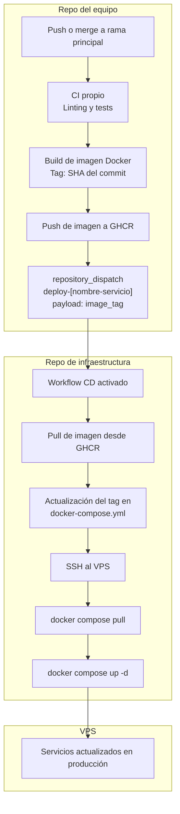

# ADR-003: Despliegue Continuo Basado en Eventos hacia VPS

**Fecha:** 2026-04-09
**Proyecto:** UfroCoin
**Decisores:** Equipos de Desarrollo (4 equipos)

---

## Índice

- [1. Contexto](#1-contexto)
- [2. Decisión](#2-decisión)
- [3. Justificación](#3-justificación)
- [4. Alternativas consideradas](#4-alternativas-consideradas)
- [5. Decisiones derivadas](#5-decisiones-derivadas)

---

## 1. Contexto

Cuatro equipos independientes desarrollan un sistema compuesto por tres microservicios y un frontend. Cada equipo trabaja en su propio repositorio y tiene autonomía sobre su ciclo de integración, pero todos comparten un único entorno de producción alojado en un VPS.

El problema central es coordinar el despliegue hacia ese entorno compartido sin que los equipos necesiten acceso directo al servidor, sin que las credenciales de infraestructura estén distribuidas entre repositorios, y sin crear un cuello de botella manual cada vez que un equipo quiere entregar un cambio.

* **Objetivo:** Definir el mecanismo mediante el cual cada equipo entrega su software de forma autónoma, y cómo ese software llega al entorno de producción de manera automatizada, trazable y segura.
* **Alcance:** Los 4 repositorios de aplicación (3 microservicios + 1 frontend), el repositorio central de infraestructura y el servidor VPS objetivo.

---

## 2. Decisión

Se establece una separación explícita entre dos fases del pipeline:

* **CI (Integración Continua):** responsabilidad de cada equipo en su propio repositorio.
* **CD (Despliegue Continuo):** responsabilidad centralizada en el repositorio de infraestructura.

### 2.1. Flujo end-to-end

### 2.2. Stack tecnológico

* **Empaquetado:** Imagen Docker por servicio, construida en el CI del equipo correspondiente.
* **Registro de imágenes:** GitHub Container Registry (GHCR), uno por repositorio de aplicación.
* **Mecanismo de disparo CD:** GitHub Actions `repository_dispatch` desde el repo del equipo hacia el repo de infraestructura.
* **Orquestación en VPS:** Docker Compose gestionado exclusivamente desde el repo de infraestructura.
* **Acceso al servidor:** SSH Keys almacenadas únicamente en el repositorio de infraestructura como GitHub Secrets.
* **Autorización entre repos:** Personal Access Tokens (PAT) de alcance mínimo, usados por cada equipo solo para emitir el evento `repository_dispatch`.

---

## 3. Justificación

### 3.1. Separación CI / CD entre repositorios

Cada equipo puede iterar, testear y publicar su imagen de forma completamente independiente. El repositorio de infraestructura no necesita conocer los detalles internos de ningún servicio; solo consume la imagen ya validada. Esto evita acoplar el ritmo de entrega de un equipo al de los demás.

### 3.2. `repository_dispatch` como mecanismo de disparo

El evento `repository_dispatch` permite que un repositorio externo active un workflow en el repo de infraestructura sin exponer credenciales del servidor. El PAT necesario para emitir ese evento tiene alcance mínimo (`repo` o `workflow`) y no otorga acceso a los secrets de infraestructura. La responsabilidad de ejecución queda centralizada.

### 3.3. GHCR como registro de imágenes

La integración nativa con GitHub elimina la necesidad de gestionar autenticación hacia registros externos. Los permisos se heredan del token de GitHub Actions, lo que simplifica la configuración en todos los repositorios involucrados.

### 3.4. Docker Compose en VPS

La topología actual (4 servicios en un solo nodo) no justifica la complejidad operativa de Kubernetes. Docker Compose ofrece orquestación suficiente con una curva de operación mínima, y el `docker-compose.yml` en el repo de infraestructura actúa como fuente de verdad del estado desplegado.

---

## 4. Alternativas consideradas

### 4.1. Opción 1: Sincronización Activa con Watchtower

* **Ventaja:** Automatización mediante modelo "pull" autónomo en el servidor; no requiere gestionar eventos de red entrantes.
* **Desventaja:** No hay control sobre cuándo ocurre el despliegue ni visibilidad en el pipeline. Dificulta el rollback y fragmenta los logs de auditoría. Cualquier imagen publicada se despliega automáticamente sin posibilidad de validación intermedia.

### 4.2. Opción 2: GitOps Básico (commit directo al repo de infraestructura)

* **Ventaja:** El repositorio de infraestructura opera como fuente de verdad absoluta mediante código declarativo.
* **Desventaja:** Si dos equipos finalizan su CI simultáneamente y ambos intentan actualizar el `docker-compose.yml`, se producen merge conflicts automatizados. Requiere lógica adicional para serializar las escrituras concurrentes.

---

## 5. Decisiones derivadas

### 5.1. Responsabilidades por equipo (repos de aplicación)

Cada equipo es responsable de mantener en su repositorio un workflow de CI que, ante un merge a la rama principal, ejecute en orden:

1. Linting y pruebas automatizadas.
2. Build de la imagen Docker etiquetada con el SHA del commit y "latest" cuando corresponda.
3. Push de la imagen a GHCR.
4. Emisión del evento `repository_dispatch` hacia el repositorio de infraestructura con el nombre del servicio y el tag de la imagen como payload.

El equipo **no** tiene acceso ni responsabilidad sobre lo que ocurre a partir del dispatch.

### 5.2. Responsabilidades del repositorio de infraestructura

El repositorio de infraestructura es responsable de:

1. Recibir el evento `repository_dispatch` e identificar el servicio afectado.
2. Actualizar el tag de imagen correspondiente en el `docker-compose.yml`.
3. Conectarse al VPS vía SSH y ejecutar `docker compose pull` y `docker compose up -d`.

Las credenciales SSH del VPS **no existirán bajo ninguna circunstancia** en los repositorios de los equipos.

### 5.3. Nomenclatura de eventos

Se establece la siguiente convención obligatoria para los eventos de dispatch:

* Tipo de evento: `deploy-[nombre-del-servicio]`
* Ejemplos: `deploy-auth`, `deploy-frontend`, `deploy-reportes`

### 5.4. Contrato de imagen

Para que el CD pueda consumir una imagen, esta debe:

* Estar publicada en GHCR antes de emitir el dispatch.
* Estar etiquetada con el SHA completo del commit que la originó.
* Ser accesible con los permisos del token de GitHub Actions del repo de infraestructura.

---

> **Estado:** Pendiente de aprobación
> **Tipo:** ADR de Arquitectura de Despliegue y CI/CD
> **Impacto:** Modifica el flujo de integración de los 4 equipos de desarrollo y establece el estándar de seguridad perimetral para la infraestructura.
